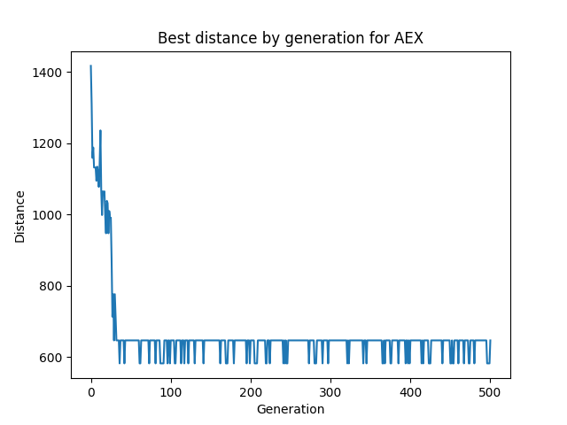
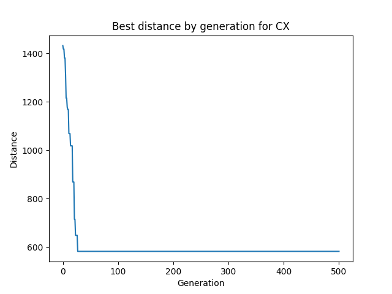
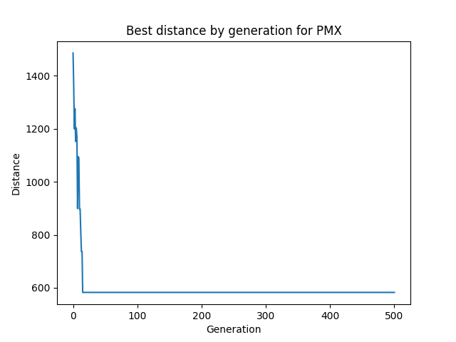
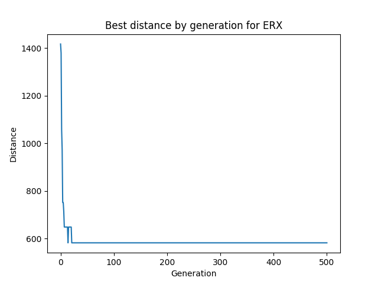
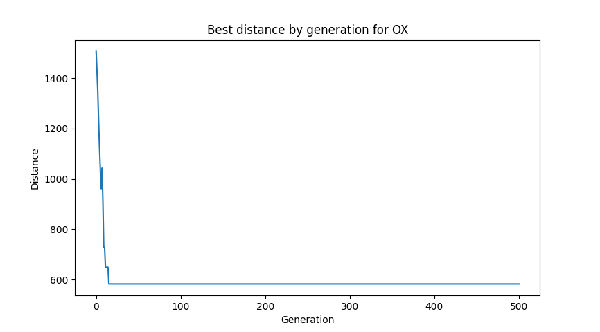

# A genetic algorithm approach to the travelling salesman problem.

## Distance matrix implementation

Instead of repeatedly calculating distances between cities, a distance matrix is created before running the genetic algorithm. It is safe to assume that distances are calculated each time a crossover and/or a mutation are performed.

Calculating the distance between two cities involves computing the Euclidean distance, which is an $O(1)$ operation. However, calculating the total distance for a route requires $O(n)$ operations, where $n$ is the number of cities.

Accessing the precomputed distance from the matrix is an $O(1)$ operation. Calculating the total distance for a route remains $O(n)$ but avoids the per-pair Euclidean calculations.

Assume:
-    $n$ - number of cities,
-    $p$ - population size,
-    $g$ - total number of generations.

**Without** distance matrix $n$ distances is computer for each route. For a population of size $p$, this happens $p$ times per generation:
$$T=g*p*n$$
On the other hand, **with** a distance matrix, the distances are fetched from it:
$$T=g*p$$

To further decrease time, consider using lower number precision because the point is to get the best route, not the precise distance.

## Crossover comparison

For 500 generations of 100 population size for 16 cities where the distance is stored in the `np.float16` data type, the execution time is as follows (average over 5 executions):

- CX time: 0.64 s

- OX time: 0.86 s

- PMX time: 0.86 s

- AEX time: 0.92 s

- ERX time: 2.10 s

In terms of convergence, the AEX crossover performs poorest by far, frequently not finding the best route.

CX finds the best route in about 30-50 generations.

PMX does it in about 25 generations.

ERX, although the slowest to complete all generations, often found the best route in under 10 (!) generations.

Finally, disregarding the occasional exception, OX finds the best route in about 25 generations.

